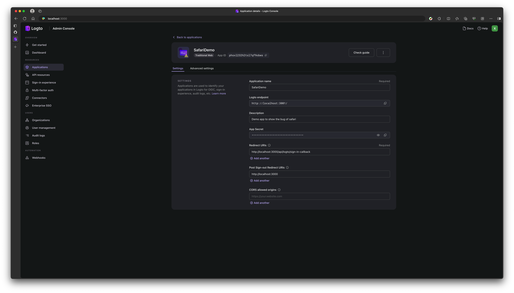

# Demo Next.js App with Logto

This is a demo next.js app with logto, to demo the sign in bug on Safari 17.

Most of the code comes from
[next-sample](https://github.com/logto-io/js/tree/e7d4344/packages/next-sample)
package from logto official.

The issue is, the app cannot work when user sign in on Safari 17, however, it
works on Chrome, Edge, Firefox and lower version of Safari 15 (~I am not sure
whether Safari 16 works~).

---
Tested on iOS 16 (simulator), it can sign in successfully, so the bug only happens 
on Safari 17, evidence:


---

It raise exceptions for both `npm run dev` and `npm run start`.

Demo:

## Safari 17 crash on `npm run start`

Run `npm run start` and open the app on both Edge and Safari 17. The app works
on Edge, but crash on Safari 17.

[Safari 17 crash on `npm run start`](./logto-bug-safari-npm-run-start.mp4)

## Safari 17 crash on `npm run dev`

Run `npm run dev` and open the app on both Edge and Safari 17. The app works
on Edge, but crash on Safari 17.

[Safari 17 crash on `npm run dev`](./logto-bug-safari-npm-run-dev.mp4)

## Environment to reproduce

- OS: macOS Sonoma 14.5
- Safari: 17.5 (19618.2.12.11.6)
- Node: v20.10.0
- Logto: svhd/logto:1.16, self hosted

- App config:
  

- Next.js `.env`:

```env
APP_ID=phsxl232h2tsl7qf9obws
APP_SECRET=obYbCsrXHOZId6qlfn1jblvhPimrrpiS
BASE_URL=http://localhost:3000
COOKIE_SECRET=aDNnrV5ENys3d2xBQMHNO4KbyNQeIGkD
ENDPOINT=http://localhost:3001/
```

## Possible causes

- This stackoverflow [answer](https://stackoverflow.com/a/70545461/2310396) give
  us a valuable lead. During my debug I found that Safari 17 do not actually
  respect the `Set-Cookie: ` header and thus `logto:<app_id>` cookie is not saved
  by Safari 17 when user initially sign in, which lead to a crash with error
  `sign_in_session.not_found` (for `npm run start`)
- Sometimes the error is `callback_uri_verification.state_mismatched`, this
  often happens when we run next.js in dev mode (`npm run dev`), my guess here is,
  `Set-Cookie: ` is called twice (reason unknown) which lead to two different
  value of `state`, thus lead to a mismatch.

## Workable deployment

Besides local development, I also deploy the same app to vercel and netlify,
with the following URLs:

- https://logto-next-safari-demo.vercel.app/
- https://logto-next-safari-demo.netlify.app/

**The app deployed on vercel and netlify was paired with logto cloud, instead of
the self hosted logto server.**

**For my test, both vercel and netlify deployments works on Safari 17. Hence, I
doubt that the issue is related to some internal quirks of Safari 17 when
dealing with same original cookies? (i.e, setting different domain for cookies
may work?)**

### Additional info for Safari bugs

- [Safari cookie is not being set – Here’s a fix](https://codedamn.com/news/web-development/safari-cookie-is-not-being-set)
- [Bug 255524 - REGRESSION (Safari 16.4): Safari sometimes doesn't send cookies for assets requests and javascript fetch requests](https://bugs.webkit.org/show_bug.cgi?id=255524)
- [Bug 198181 - Cookies with SameSite=None or SameSite=invalid treated as Strict](https://bugs.webkit.org/show_bug.cgi?id=198181)
- [Set-cookie header works on Google Chrome and FF but no Safari](https://elixirforum.com/t/set-cookie-header-works-on-google-chrome-and-ff-but-no-safari/20867/4)
- [Cookies are not getting stored on localhost subdomains in Safari](https://stackoverflow.com/questions/75386961/cookies-are-not-getting-stored-on-localhost-subdomains-in-safari)

## Production example

This bug was discovered by PPResume, and here is a
[list](https://github.com/ppresume/community/issues/59) of user agents that
crashes. It works on Safari 15 but crashes on Safari 17.

Demo:

[Safari 15 works and 17 crashes](./logto-bug-safari-15-vs-17.mp4)

---

# Next Sample

This is a sample project for Logto's Next.js SDK.

[](https://vercel.com/new/clone?repository-url=https%3A%2F%2Fgithub.com%2Flogto-io%2Fjs%2Ftree%2Fmaster%2Fpackages%2Fnext-sample&env=APP_ID,APP_SECRET,ENDPOINT,BASE_URL,COOKIE_SECRET,RESOURCES,SCOPES&envDescription=Configuration%20needed%20to%20init%20Logto%20client&envLink=https%3A%2F%2Fgithub.com%2Flogto-io%2Fjs%2Ftree%2Fmaster%2Fpackages%2Fnext-sample%2FREADME.md&project-name=logto-js&repository-name=logto-js)

## Configuration

You can configure the sample project by modifying the `libraries/config.js` file, or by setting the following environment variables:

| key           | description                                             | example                                          |
| ------------- | ------------------------------------------------------- | ------------------------------------------------ |
| APP_ID        | The app ID of your application                          | `my-app`                                         |
| APP_SECRET    | The app secret of your application                      | `my-secret`                                      |
| ENDPOINT      | The endpoint of your Logto server                       | `http://localhost:3001`                          |
| BASE_URL      | The base URL of this application                        | `http://localhost:3000`                          |
| COOKIE_SECRET | The secret for cookie encryption                        | `my-cookie-secret`                               |
| RESOURCES     | Optional, the API resource identifier, split with comma | `http://localhost:3003/,http://localhost:3004/]` |
| SCOPES        | Optional, the scopes to grant, split with comma         | `read:users,write:users`                         |

Learn more about resource and scopes in the [Logto RBAC Documentation](https://docs.logto.io/docs/recipes/rbac/protect-resource#configure-client-sdk).
